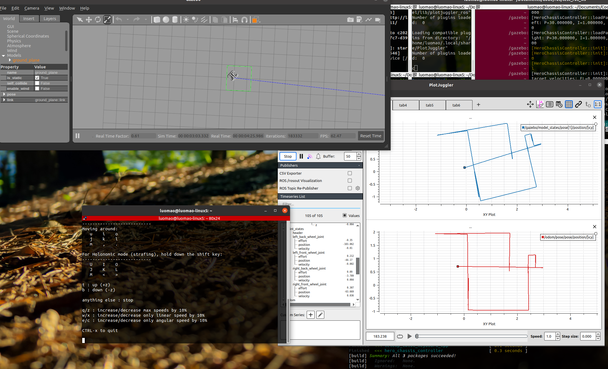

# Hero Chassis Controller

## Overview

🚗🚗🚗 This ROS package implements various control mechanisms for a four-wheeled mobile robot, including PID control, kinematics, odometry, and global velocity control. It also supports additional customizable features. The controller is based on `ros_control` and is loaded using `pluginlib`. 🚗🚗🚗

**Keywords:** hero_chassis_controller, ROS, ros_control, mobile robot, pluginlib

### License

📜📜📜 The source code is released under a [BSD 3-Clause license](LICENSE.txt). 📜📜📜

**Author:** Mao Luo  
**Affiliation:** [Mao Luo](https://github.com/gdut-dynamic-x/simple_chassis_controller/blob/master)  
**Maintainer:** Mao Luo, 3214283533@qq.com

🛠️🛠️🛠️ The Hero Chassis Controller package has been tested on ROS Indigo and Noetic on Ubuntu 20.04. This is research code, and changes may occur frequently; fitness for any particular purpose is disclaimed. 🛠️🛠️🛠️



## Installation

### Building from Source

#### Dependencies

📚📚📚 - [Robot Operating System (ROS)](http://wiki.ros.org) (middleware for robotics)
- [Eigen](http://eigen.tuxfamily.org) (linear algebra library) 📚📚📚

Install dependencies:

```bash
sudo rosdep install --from-paths src
```

#### Building

🔧🔧🔧 To build from source, clone the latest version from this repository into your catkin workspace and compile the package: 🔧🔧🔧

```bash
cd ~/catkin_ws/src
git clone https://github.com/maoluois/DX-final-exam.git
cd ../
rosdep install --from-paths . --ignore-src
catkin_make
```

### Running in Docker

🐋🐋🐋 Docker is a convenient way to run an application with all dependencies bundled together. First, [install Docker](https://docs.docker.com/get-docker/). 🐋🐋🐋

Spin up a simple container:

```bash
docker run -ti --rm --name ros-container ros:noetic bash
```

Now, create a catkin workspace, clone the package, build it, and source the setup:

```bash
apt-get update && apt-get install -y git
mkdir -p /ws/src && cd /ws/src
git clone https://github.com/maoluois/DX-final-exam.git
cd ..
rosdep install --from-path src
catkin_make
source devel/setup.bash
roslaunch hero_chassis_controller hero_chassis_controller.launch
```

## Usage

🎛️🎛️🎛️ Run the main node: 🎛️🎛️🎛️

```bash
roslaunch hero_chassis_controller hero_chassis_controller.launch
```

## Configuration Files

### Config File: `pid_params.yaml`

📄📄📄 Defines PID control parameters for each wheel: 📄📄📄

```yaml
controller:
  hero_chassis_controller:
    type: hero_chassis_controller/HeroChassisController
    front_left:
      p: 30.0
      i: 1.0
      d: 0.0
      target_velocity: 10.0

    front_right:
      p: 30.0
      i: 1.0
      d: 0.0
      target_velocity: 10.0

    back_left:
      p: 30.0
      i: 1.0
      d: 0.0
      target_velocity: 10.0

    back_right:
      p: 30.0
      i: 1.0
      d: 0.0
      target_velocity: 10.0
```

📄📄📄 Defines controllers mode (global or base): 📄📄📄

```yaml
velocity: global  
```

📄📄📄 Defines robot wheel base and track width: 📄📄📄

```yaml
wheel_base: 0.4
track_width: 0.4
```

## Nodes

### `hero_chassis_controller`

🤖🤖🤖 Implements the main chassis control logic. 🤖🤖🤖

#### Subscribed Topics

- **`/cmd_vel`** ([geometry_msgs/Twist]): Velocity commands for the robot.

#### Published Topics

- **`/cmd_vel`** ([geometry_msgs/Twist]): Velocity commands for the robot.
- **`/odom`** ([nav_msgs/Odometry]): Odometry information.
- **`/tf`**: Transform between `odom` and `base_link`.

#### Parameters

- **`wheel_radius`** (double): Radius of the wheels. Default: `0.07625`.
- **`wheel_base`** (double): Distance between front and back wheels. Default: `0.4`.
- **`track_width`** (double): Distance between left and right wheels. Default: `0.4`.

## Bugs & Feature Requests

🐞🐞🐞 Please report bugs and request features using the [Issue Tracker](https://github.com/maoluois/DX-final-exam.git). 🐞🐞🐞

[ROS]: http://www.ros.org
[Eigen]: http://eigen.tuxfamily.org
[geometry_msgs/Twist]: http://docs.ros.org/api/geometry_msgs/html/msg/Twist.html
[nav_msgs/Odometry]: http://docs.ros.org/api/nav_msgs/html/msg/Odometry.html

